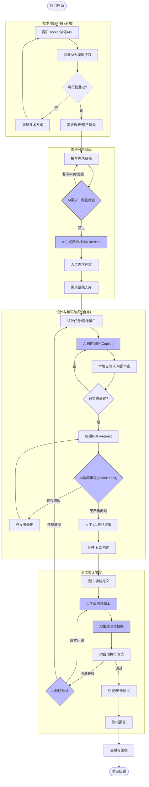

# 智能在线编程练习平台——改进后的完整软件过程定义文档

------

## 1. 过程概述与目标

### 1.1 过程名称

**AI增强型时间盒阶段开发过程**（AI-Enhanced Time-boxed Phased Development Process，简称 AIE-TPDP）。

### 1.2 过程定义来源

本过程是在《软件过程裁剪与定义》v1.0 的基础上，遵循 ISO/IEC 12207 标准框架，结合本项目的技术特点（传统OJ判题 + AI大模型双引擎）、团队规模（6人学生团队）以及12周开发周期约束，通过系统性的剪裁与AI技术融合而形成的定制化软件过程。

原始剪裁决策包括：

- 取消正式的Fagan审查，改用轻量级PR评审；
- 合并“详细设计”与“编码”阶段；
- 增加技术预研（Spike）子流程；
- 简化文档交付物集。

本版本新增了以下AI融合剪裁：

- 在需求阶段增加AI辅助一致性检查和验收标准生成；
- 在编码阶段增加AI结对编程和AI预审查节点；
- 在测试阶段增加AI测试用例与数据生成；
- 在过程度量中增加AI贡献度指标。

### 1.3 过程目标

1. **效率目标**：通过人机协同，将核心业务流程（从需求到上线的平均周期）缩短 **20% 以上**。
2. **质量目标**：将线上缺陷密度降低 **25%**，特别是将代码安全漏洞和判分逻辑错误降至 **0**。
3. **AI融合目标**：使 AI 工具参与至少 **3 个** 核心生命周期阶段，并实现 AI 产出物的人工采纳率达到 **70% 以上**。
4. **合规目标**：满足毕业设计/课程答辩的文档与交付要求，同时保证过程可复现、可审计。

------

## 2. 过程剪裁的详细依据（与ISO/IEC 12207的对照）

本过程对 ISO/IEC 12207 标准的剪裁遵循“轻量化、高价值、风险驱动”原则，具体剪裁方案如下表所示：

| ISO/IEC 12207 过程类别 | 标准建议活动                                                 | 本过程剪裁决策                                               | 剪裁理由                                                     | AI融合影响                                                   |
| :--------------------- | :----------------------------------------------------------- | :----------------------------------------------------------- | :----------------------------------------------------------- | :----------------------------------------------------------- |
| **开发过程**           | 详细的系统/软件需求分析、架构设计、详细设计、编码、集成、测试 | 1. 合并详细设计与编码 2. 增加技术预研（Spike）迭代           | 项目使用成熟框架（SpringBoot），设计与代码高度耦合；OJ引擎和AI接口存在技术风险，需提前验证 | AI辅助编码（Copilot）和AI测试生成可进一步压缩设计到编码的转换时间 |
| **支持过程**           | 正式的同行评审（Fagan审查）、质量保证计划、验证计划          | 1. 取消正式同行评审，改为轻量级PR审查 2. 取消独立的质量保证计划，将QA活动融入CI和每日站会 | 团队规模小、沟通成本低，过度形式化降低效率；CI工具可自动执行大部分质量检查 | PR阶段引入AI代码审查官（CodeRabbit），替代部分人工审查，保持质量门禁 |
| **管理过程**           | 独立的项目计划、质量计划、风险管理计划                       | 合并为单一《立项计划书》+《风险管理表》                      | 课程项目规模可控，单一文档足够覆盖管理需求                   | 无变化                                                       |
| **组织过程**           | 基础设施、培训、度量                                         | 保留基础设施（GitHub/语雀），新增AI工具使用培训              | 团队对AI工具不熟悉，需要快速提升能力                         | 新增“AI工具培训”作为组织过程资产                             |

------

## 3. 改进后的全生命周期活动流程图（含AI节点）

下图使用 Mermaid 绘制，展示了从项目启动到交付的五个阶段，并标注了AI参与的关键节点（蓝色菱形）和人工决策点。

**流程图说明**：

- **蓝色填充节点**：AI工具自动执行或辅助执行的活动。
- **虚线反馈回路**：表示AI或人工发现的缺陷导致任务回退。
- **新增阶段**：技术预研（Spike）作为独立阶段插入在需求之前，用于验证核心技术风险。

------

## 4. 各阶段详细活动与AI融合说明

### 4.1 阶段0：技术预研（Spike）—— 新增AI相关活动

| 活动编号 | 活动名称                | 输入                       | 输出                           | 参与角色           | AI工具/技术                             | 时间约束 |
| :------- | :---------------------- | :------------------------- | :----------------------------- | :----------------- | :-------------------------------------- | :------- |
| SPK-01   | Docker沙箱API可行性验证 | Docker官方文档、OJ开源项目 | 可运行的Hello World判分容器    | 后端开发、项目组长 | ChatGPT辅助编写Dockerfile和Java调用代码 | 1.5天    |
| SPK-02   | AI大模型接口对接验证    | 阿里云/OpenAI API文档      | 成功调用并获得代码评价的Demo   | 后端开发           | Postman + AI生成Prompt模板              | 1.5天    |
| SPK-03   | 技术预研报告            | 上述验证结果               | 《技术预研报告》（含风险评估） | 全体成员           | AI辅助汇总分析                          | 1天      |

### 4.2 阶段1：需求分析阶段（AI增强）

| 活动编号 | 活动名称               | 输入                   | 输出                                  | 参与角色                | AI工具/节点                                                  | 质量标准                   |
| :------- | :--------------------- | :--------------------- | :------------------------------------ | :---------------------- | :----------------------------------------------------------- | :------------------------- |
| RA-01    | 需求调研与用户故事编写 | 用户访谈记录、竞品分析 | 原始需求列表                          | 产品兼需求组员          | 无                                                           | 每个用户故事符合INVEST原则 |
| RA-02    | 撰写需求规格说明书草稿 | 原始需求列表           | 《需求规格说明书》初稿（Markdown）    | 产品兼需求组员          | ChatGPT/通义千问辅助扩写、格式化                             | 覆盖所有功能与非功能需求   |
| RA-03    | **AI需求一致性检查**   | 需求初稿各章节         | 冲突/遗漏报告                         | AI需求分析师（人+工具） | Prompt：“检查以下需求描述中是否存在逻辑矛盾或与已定义约束冲突” | 检出率≥90%                 |
| RA-04    | 人工修正需求           | 冲突报告               | 修正后的需求文档                      | 产品兼需求组员          | 无                                                           | 所有AI报告的问题均处理     |
| RA-05    | **AI生成验收标准**     | 每个功能需求条目       | Gherkin格式的验收场景（.feature文件） | AI需求分析师            | Prompt：“为以下需求生成Given-When-Then验收标准，包含正例和反例” | 覆盖80%以上功能点          |
| RA-06    | 正式需求评审           | 需求文档、验收标准     | 评审意见、基线需求                    | 全体成员                | 无                                                           | 全员签字确认               |

### 4.3 阶段2：设计与编码阶段（合并 + AI增强）

| 活动编号 | 活动名称               | 输入                  | 输出                         | 参与角色            | AI工具/节点                    | 质量标准                       |
| :------- | :--------------------- | :-------------------- | :--------------------------- | :------------------ | :----------------------------- | :----------------------------- |
| DC-01    | 领取开发任务           | 需求基线、接口契约    | 个人任务清单                 | 前后端开发          | 无                             | 任务明确且可测试               |
| DC-02    | **AI辅助编码**         | 自然语言注释/函数签名 | 代码实现（Java/Python/前端） | 开发人员            | GitHub Copilot / Tabnine       | 生成代码行占比≤40%，需人工理解 |
| DC-03    | 本地自测与**AI预审查** | 本地代码变更          | 预审查报告                   | 开发人员            | SonarLint / Codacy（本地运行） | 无严重违规，圈复杂度≤10        |
| DC-04    | 创建Pull Request       | 功能分支代码          | GitHub PR                    | 开发人员            | 无                             | PR描述包含测试结果             |
| DC-05    | **AI协同审查**         | PR代码、提交说明      | 逐行评论（安全、性能、规范） | AI代码审查官        | CodeRabbit / Qodo Merge        | 识别100%已知高危漏洞模式       |
| DC-06    | 人工+AI最终评审        | AI评论、开发者回复    | 合并决策                     | 项目组长/技术负责人 | 人工判断                       | 所有AI“严重”级别问题必须解决   |
| DC-07    | 合并代码并触发CI       | 合并后的代码          | 构建产物、单元测试报告       | CI系统              | GitHub Actions                 | 所有测试通过                   |

### 4.4 阶段3：测试验证阶段（AI增强）

| 活动编号 | 活动名称              | 输入                     | 输出                                 | 参与角色       | AI工具/节点                  | 质量标准                 |
| :------- | :-------------------- | :----------------------- | :----------------------------------- | :------------- | :--------------------------- | :----------------------- |
| TV-01    | 接口/功能定义确认     | OpenAPI规范、需求文档    | 测试策略                             | 测试兼文档组员 | 无                           | 定义测试优先级           |
| TV-02    | **AI生成API测试脚本** | OpenAPI规范（YAML/JSON） | Postman/Newman测试集合               | AI测试工程师   | Postbot AI / Swagger Codegen | 覆盖所有接口的主要路径   |
| TV-03    | **AI生成测试数据**    | 数据模型定义             | 边界值、异常值、随机数据（CSV/JSON） | AI测试工程师   | Faker.js + ChatGPT           | 触发≥3种非预期异常       |
| TV-04    | CI自动执行测试        | 测试脚本、测试数据       | 测试报告（通过/失败）                | CI系统         | GitHub Actions + Newman      | 100%自动化               |
| TV-05    | **AI辅助缺陷分析**    | 失败日志、堆栈信息       | 根因分析建议                         | AI测试工程师   | ChatGPT / 通义千问           | 准确率≥70%               |
| TV-06    | 性能与安全测试        | 部署后系统               | JMeter报告、安全扫描报告             | 测试兼文档组员 | OWASP ZAP / k6               | 满足需求文档中的性能指标 |
| TV-07    | 回归测试与缺陷闭环    | 修复后的代码             | 最终测试报告                         | 全体           | 同上                         | 无P0/P1级别缺陷          |

### 4.5 阶段4：运维与监控阶段（轻量AI）

| 活动编号 | 活动名称             | 输入                         | 输出               | 参与角色       | AI工具/节点                            | 质量标准           |
| :------- | :------------------- | :--------------------------- | :----------------- | :------------- | :------------------------------------- | :----------------- |
| OM-01    | 服务器部署与监控配置 | 部署手册                     | 运行中的云服务器   | 后端开发       | 阿里云监控                             | 可用性≥99.5%       |
| OM-02    | **AI日志异常检测**   | 应用日志、判分引擎日志       | 异常告警与模式摘要 | 项目组长       | 自写脚本+ChatGPT API                   | 识别≥80%的异常模式 |
| OM-03    | **AI生成运维周报**   | GitHub提交、CI状态、日志摘要 | 周报（Markdown）   | 测试兼文档组员 | Prompt：“根据以下数据生成本周运维报告” | 每周一自动生成     |

------

## 5. 角色职责定义（新增AI相关角色）

| 角色名称          | 原角色/新增                  | 核心职责                                                     | 与AI的交互方式                           | 技能要求                               |
| :---------------- | :--------------------------- | :----------------------------------------------------------- | :--------------------------------------- | :------------------------------------- |
| **AI需求分析师**  | 新增（由产品兼需求组员履行） | 1. 使用AI工具进行需求文档冲突检测 2. 从用户故事生成验收标准 3. 确保AI输出质量 | 操作Prompt，审查AI报告，决定是否采纳     | 需求工程基础 + Prompt设计能力          |
| **AI结对程序员**  | 新增（由所有开发人员履行）   | 使用AI辅助编码工具提高开发效率                               | 将AI建议作为参考，批判性采纳             | 扎实的编程基础，能识别AI生成的错误代码 |
| **AI代码审查官**  | 新增（CI中的AI Agent）       | 自动分析PR代码，生成安全、性能、规范评论                     | 完全自动化，无需人工干预                 | 无（由工具提供）                       |
| **AI测试工程师**  | 新增（由测试兼文档组员履行） | 1. 使用AI生成测试脚本和数据 2. 对AI生成的测试进行审核和补充  | 提供测试策略，运行AI生成工具，审核输出   | 测试设计 + API测试经验 + Prompt工程    |
| **项目组长**      | 原有                         | 统筹全局，风险管理，技术选型                                 | 不直接使用AI，但需评估AI工具的风险和收益 | 项目管理 + 架构理解                    |
| **后端/前端开发** | 原有（职责变更）             | 除编码外，需使用AI辅助工具，并参与AI审查的反馈               | 与AI结对编程，响应AI审查评论             | 增加对AI工具的熟练使用                 |

------

## 6. 交付物清单与质量标准（含AI贡献度指标）

| 生命周期阶段 | 核心交付物                       | 格式                | 质量标准                                                     | AI贡献度指标                                    |
| :----------- | :------------------------------- | :------------------ | :----------------------------------------------------------- | :---------------------------------------------- |
| 技术预研     | 《技术预研报告》                 | Markdown            | 包含Docker沙箱和AI接口的可行性结论、Demo代码链接             | AI辅助生成报告内容占比≤30%                      |
| 需求分析     | 《需求规格说明书》（含验收标准） | Markdown + .feature | 1. 功能需求覆盖率100% 2. AI一致性检查无未解决冲突 3. 验收标准可执行 | 验收标准AI生成率 ≥ 80% 冲突AI检出率 ≥ 90%       |
| 设计与编码   | 项目源代码 + OpenAPI规范         | Java/TS/YAML        | 1. 通过AI预审查（无严重问题） 2. 单元测试覆盖率≥70% 3. 通过CI构建 | AI生成代码行占比 ≤ 40% AI审查建议采纳率 ≥ 50%   |
| 测试验证     | 《测试报告》 + 自动化测试脚本集  | Markdown + JSON     | 1. 自动化测试通过率100% 2. 性能指标满足需求文档PERF-xxx      | 测试脚本AI生成率 ≥ 60% AI发现的缺陷数占比 ≥ 20% |
| 项目结题     | 用户手册、部署手册、演示视频     | Markdown/MP4        | 部署手册可复现成功部署                                       | AI辅助生成手册内容 ≤ 50%                        |

------

## 7. 过程度量指标（含AI贡献度指标）

| 度量类别   | 指标名称                                                     | 目标值    | 数据来源                     | 采集频率 |
| :--------- | :----------------------------------------------------------- | :-------- | :--------------------------- | :------- |
| **效率**   | 需求到编码的平均周期                                         | ≤3天      | JIRA/项目管理看板            | 每周     |
| **效率**   | PR从创建到合并的平均时间                                     | ≤2小时    | GitHub API                   | 每次PR   |
| **效率**   | **AI编码辅助节省时间比**                                     | ≥20%      | 开发者周报自评 + Copilot统计 | 每周     |
| **质量**   | 线上故障（P0/P1）数量                                        | 0         | 运维监控                     | 持续     |
| **质量**   | PR中被AI审查发现的严重问题数                                 | 每个PR ≥1 | CodeRabbit评论统计           | 每次PR   |
| **质量**   | **AI审查漏掉的严重缺陷数**                                   | ≤1个/迭代 | 人工评审补充记录             | 每次迭代 |
| **AI特定** | **AI测试用例有效率**（AI生成且能正确发现变更导致失败的比例） | ≥80%      | CI流水线数据                 | 每次构建 |
| **AI特定** | **AI验收标准的采纳率**（最终需求中保留的AI生成验收标准比例） | ≥70%      | 需求评审记录                 | 每个版本 |
| **管理**   | 计划偏差率（实际进度 vs WBS）                                | ≤15%      | 项目周报                     | 每周     |

------

## 8. 工具链与环境配置

| 用途               | 工具名称                   | 版本/规格    | 备注                 |
| :----------------- | :------------------------- | :----------- | :------------------- |
| 代码仓库与版本控制 | GitHub                     | 免费组织版   | 启用PR模板、保护分支 |
| 项目管理与协作     | 飞书 + 语雀                | 免费版       | 每日站会同步         |
| 需求/设计辅助      | ChatGPT-4o / 通义千问      | API或Web     | 需合理使用Token      |
| AI辅助编码         | GitHub Copilot             | 学生免费授权 | IDE插件              |
| AI代码审查         | CodeRabbit                 | 免费开源版   | GitHub App安装       |
| CI/CD              | GitHub Actions             | 免费         | 运行测试、构建       |
| API测试生成        | Postman + Postbot AI       | 免费版       | 需导出OpenAPI        |
| 性能测试           | k6                         | 开源         | 脚本编写             |
| 安全测试           | OWASP ZAP                  | 开源         | 被动扫描             |
| 监控与日志         | 阿里云监控 + 自建Loki      | 按量付费     | 可选                 |
| 文档编写           | VS Code + Markdown Preview | 免费         | 使用Mermaid画图      |

------

## 9. 风险识别与应对（过程相关）

| 风险类型     | 风险描述                                         | 可能性 | 影响 | 应对措施（过程层面）                                         |
| :----------- | :----------------------------------------------- | :----- | :--- | :----------------------------------------------------------- |
| **技术风险** | AI工具（如Copilot）生成不安全的代码（如SQL注入） | 中     | 高   | 强制在AI预审查节点中使用静态代码安全扫描插件                 |
| **管理风险** | 团队成员过度依赖AI，导致对代码理解不足           | 高     | 中   | 在PR评审中强制要求开发者用文字解释AI生成的核心逻辑           |
| **外部依赖** | AI服务API调用超时或限流                          | 中     | 中   | 在CI流水线中将AI审查步骤设置为“非阻塞”，超时3分钟后自动跳过并告警 |
| **数据安全** | 代码片段被AI工具收集用于模型训练                 | 低     | 高   | 选用符合数据隐私要求的工具（如企业版），或在PR中脱敏         |
| **过程合规** | 评审记录不完整，导致答辩质疑                     | 低     | 中   | 所有AI审查评论和人工响应均保留在GitHub PR中，作为过程证据    |

------

