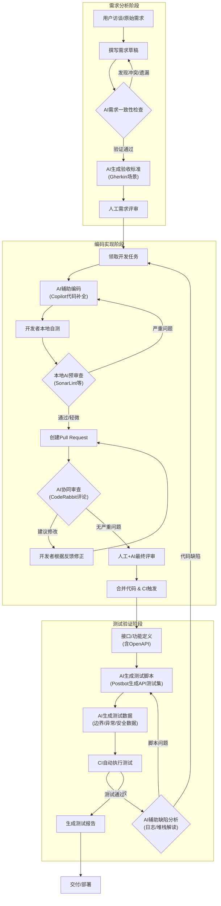

# 软件过程改进方案设计文档

#### 1. 引言

基于《AI技术应用场景匹配报告》的分析，本报告针对“编码实现”、“测试验证”、“需求分析”三个关键环节，提出具体的软件过程改进方案。方案包括过程重构（新增角色/活动）、工具链选型与集成、以及风险评估与应对。

#### 2. 过程重构方案

我们定义改进后的过程为 **“AI-Enhanced Agile Process” (AIEAP)**，其与原有过程的融合点如下：

| 原生命周期阶段 | 原核心活动                                     | 新增AI相关角色                                               | 融入的AI工具/节点                                            | 改进后的活动流程                                             | AI输出物质量标准                                             |
| :------------- | :--------------------------------------------- | :----------------------------------------------------------- | :----------------------------------------------------------- | :----------------------------------------------------------- | :----------------------------------------------------------- |
| **需求分析**   | 需求调研、文档撰写、需求评审                   | **AI需求分析师 (AI Analyst)** - 由项目组成员（如产品经理）通过AI工具扮演 | 1. **需求一致性检查节点** 2. **验收标准生成节点**            | 用户访谈 → 需求草稿 → **【AI节点1：AI检查需求冲突】** → 人工修正 → **【AI节点2：生成验收标准(Gherkin语法)】** → 正式需求评审 | 1. 需求条目间无逻辑矛盾。 2. 生成的验收标准覆盖80%+的正例和反例场景。 |
| **编码实现**   | 功能开发、代码自测、人工代码审查 (PR)          | **AI结对程序员 (AI Pair)** - 开发人员自身 **AI代码审查官 (AI Reviewer)** - 在CI流程中自动运行 | 1. **AI辅助编码节点 (IDE)** 2. **AI预审查节点 (PR前)** 3. **AI协同审查节点 (PR中)** | 任务领取 → **【AI节点1：Copilot辅助编码】** → 开发者提交代码 → **【AI节点2：本地AI预审查】** → 创建PR → **【AI节点3：AI Reviewer评论】** → 人工+AI协同评审 → 合并代码 | 1. 代码符合团队编码规范。 2. 识别出100%的已知高危漏洞模式（如OWASP Top 10）。 3. 提供至少1条关于性能或可读性的优化建议。 |
| **测试验证**   | 测试用例设计、测试脚本编写、执行测试、缺陷跟踪 | **AI测试工程师 (AI Tester)** - 测试人员或CI系统              | 1. **AI生成测试用例节点** 2. **AI生成测试数据节点** 3. **AI自愈测试脚本节点** (可选) | 功能/接口定义 → **【AI节点1：生成API测试脚本】** → **【AI节点2：生成边界/异常测试数据】** → 执行自动化测试 → 【反馈】 → 若脚本因UI微调失败，触发【AI节点3：自愈修复】 | 1. 接口测试脚本对主要功能点的覆盖率达到100%。 2. 生成的异常测试数据能触发至少3种非预期的系统错误（如空指针、超长字符串）。 |

下图直观展示了上述三个改进环节的融合流程，包含人工活动（方框）、AI节点（菱形/圆角矩形）、决策分支和关键交付物

#### 3. 工具链选型与集成方案

| 改进环节     | 工具名称                          | 核心功能                                   | 集成方式                                                     | 预期效率提升指标                                             |
| :----------- | :-------------------------------- | :----------------------------------------- | :----------------------------------------------------------- | :----------------------------------------------------------- |
| **需求分析** | **ChatGPT-4o / 通义千问**         | 需求文档一致性检查、验收标准生成           | 通过Web界面或API，将需求章节内容作为Prompt输入。输出结果人工确认后，粘贴至Markdown文档。 | 需求评审返工率 **降低40%**；验收标准编写时间 **减少50%**。   |
| **编码实现** | **GitHub Copilot**                | 代码自动补全、根据注释生成代码             | IDE插件(VS Code/IDEA)直接集成，开发者使用公司或教育邮箱授权。 | 开发新功能平均耗时 **减少30%**；样板代码编写时间 **减少70%**。 |
| **编码实现** | **CodeRabbit / Qodo Merge**       | PR代码自动审查、生成审查摘要、提出优化建议 | 在GitHub中安装App，配置其在PR创建和更新时自动触发，将评论作为PR的对话。 | 人工代码审查时间 **减少50%**；常见低级错误 **降低80%**。     |
| **测试验证** | **Postman + Newman + Postbot AI** | 根据OpenAPI生成测试集合、自动生成测试数据  | 导入OpenAPI规范到Postman → 使用Postbot AI生成集合 → 使用Newman集成到CI流水线(GitHub Actions)。 | API测试用例编写时间 **减少60%**；测试场景覆盖度 **提升50%**。 |

#### 4. 风险评估与应对策略

| 风险类型          | 具体风险描述                                                 | 可能性 | 影响程度 | 应对策略                                                     |
| :---------------- | :----------------------------------------------------------- | :----- | :------- | :----------------------------------------------------------- |
| **数据安全**      | AI代码审查工具（如CodeRabbit）将代码片段上传至第三方服务器，导致核心算法（如判分逻辑）泄露。 | 中     | 高       | 1. **选型限制**：优先选择提供数据本地化或私有化部署方案的商业工具。 2. **信息脱敏**：在PR描述中，避免粘贴核心算法逻辑，仅让AI审查非核心模块。 3. **合同/协议**：仔细阅读工具的数据处理协议，确保代码仅用于本次审查，不被用于模型训练。 |
| **模型偏见/质量** | AI生成的测试用例或代码存在“偏见”，例如只生成通过性测试，忽略了破坏性测试；或生成的代码存在性能缺陷。 | 高     | 中       | 1. **人工兜底**：明确AI输出仅为“初稿”或“建议”，必须经过至少一名具有经验的团队成员审查和批准。 2. **Prompt优化**：通过精心设计的Prompt（例如：“请生成包含正常、异常和边界情况的测试用例”）来引导AI的行为。 |
| **技术依赖**      | AI服务出现API不可用、响应过慢等问题，阻塞核心开发或CI流程。  | 中     | 中       | 1. **异步/非阻塞**：在CI流程中，AI审查步骤应设置为“可选”而非“强制”，即使超时也不应阻塞PR合并。 2. **多模型备选**：对于关键需求（如代码生成），准备本地的小型代码模型（如CodeLlama）作为云服务的备选。 |
| **过度信任**      | 开发者过于依赖AI生成的代码，不经思考直接使用，引入难以排查的复杂缺陷。 | 高     | 高       | 1. **建立过程约束**：在过程定义中强制要求，所有AI生成的代码必须有“人工理解注释”或经过至少一轮手工重构。 2. **技术分享会**：定期举办“AI生成代码缺陷分析”分享会，增强团队对AI输出的批判性思维。 |

#### 5. 结论

本改进方案通过引入AI角色和工具，重构了需求、编码、测试三个关键过程。方案明确了具体的集成方式和预期收益，并对潜在风险制定了详细的应对策略，具备高度可落地性。下一步将选择核心场景进行原型验证。